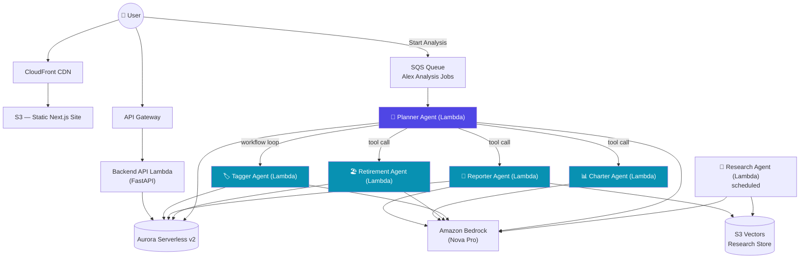
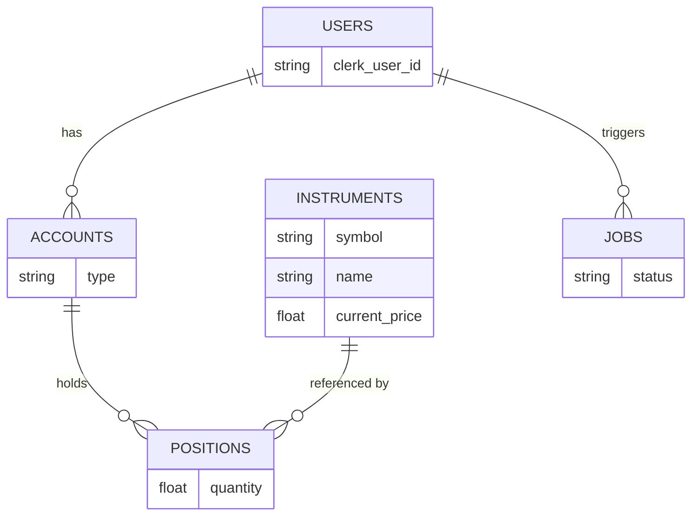

# Alex - AI Financial Planner 🧭

> An agentic, production-grade SaaS platform where a team of collaborating AI agents analyzes your portfolio, tags your holdings, projects your retirement, and visualizes it all — deployed serverless on AWS.

[](#infrastructure)
[](#agent-orchestra)
[](#frontend)
[](#infrastructure)
[](#license)

---

## Overview

**Alex** (Agentic Learning Equities eXplainer) is a full-stack, multi-agent SaaS application that acts as an AI financial planner. Users connect their brokerage, retirement, and savings accounts, and a team of five specialized AI agents collaborates — each running as an **independent, horizontally scalable AWS Lambda function** — to produce a portfolio report, retirement projections, and auto-generated visualizations.

This isn't a single LLM call wrapped in a chat UI. It's a distributed, event-driven system built the way a production agentic platform actually should be: decoupled services, a message queue, structured outputs, tool calling, retries, and infrastructure as code.

---

## Key Features

- 🔐 **Authenticated multi-tenant SaaS** — Clerk-based auth, per-user portfolios
- 🤖 **Five-agent orchestra** — a planner autonomously decides which specialists to invoke
- 📊 **Auto-generated visualizations** — charts are designed and described by an AI agent, not hardcoded
- 📈 **Live market data** — real share prices via the Polygon.io API
- 🧠 **Retirement projections** — Monte Carlo–style simulation feeding an LLM-generated readiness assessment
- 🏷️ **Automatic instrument classification** — geography, asset class, and sector tagging via structured outputs
- 🔎 **Grounded research** — a background research agent continuously ingests market data into a vector store the reporter agent can query
- ⚡ **Fully serverless & elastic** — scales to zero, scales to demand, no servers to manage
- 🌐 **Deployed to the real internet** — CloudFront + API Gateway, not just `localhost`

---

## Architecture



Each blue box is a **completely separate deployed Lambda service**. When the planner "calls" the charter agent, it isn't making a local function call — it's making a real network call to a different serverless endpoint. This is what makes the system independently scalable, testable, and observable, rather than one monolithic agent loop.

---

## The Agent Orchestra

| Agent | Role | Tools | Structured Output |
|---|---|---|---|
| **Planner** | Orchestrator — autonomously decides which specialists to invoke for a given job | ✅ `invoke_reporter`, `invoke_charter`, `invoke_retirement` | — |
| **Tagger** | Classifies instruments by asset class, geography, and sector | — | ✅ `InstrumentClassification` |
| **Reporter** | Produces the portfolio analysis report | ✅ `get_market_insights` (queries the research vector store) | — |
| **Charter** | Designs portfolio visualizations, expressed as chart JSON | — | — |
| **Retirement** | Projects retirement readiness from account data & simulation output | — | — |

**Design note:** tagging is handled by a plain Python **workflow loop**, not an autonomous tool call — the planner scans for untagged instruments and invokes the tagger directly. Not every coordination problem needs an agent to decide it; sometimes deterministic code is simply the right tool.

---

## Data Model



---

## Tech Stack

**Frontend**
- Next.js (Pages Router) · TypeScript · Tailwind CSS · Clerk Auth

**Backend / Agents**
- Python · OpenAI Agents SDK · LiteLLM (Bedrock adapter) · Tenacity (retry/backoff)

**AI / ML**
- Amazon Bedrock (Nova Pro) · Amazon SageMaker (embeddings) · S3 Vectors

**Data**
- Amazon Aurora Serverless v2 (PostgreSQL-compatible)

**Infrastructure**
- Terraform · AWS Lambda · API Gateway · SQS · CloudFront · S3 · IAM · Secrets Manager · CloudWatch

**External APIs**
- Polygon.io (live market data)

---

## Infrastructure

Everything is defined as code and deployed incrementally, one Terraform module per build phase:

```
terraform/
├── 1_...            # foundational IAM / networking
├── ...
├── 5_database/       # Aurora Serverless v2
├── 6_agents/         # 5 agent Lambdas + SQS queue
└── 7_front_end/      # S3 + CloudFront + API Gateway + API Lambda
```

- **Aurora Serverless v2** — autoscales capacity automatically; no idle server cost
- **SQS** — decouples the "start analysis" click from the agentic workflow itself
- **API Gateway** — rate limiting & throttling in front of every Lambda call
- **CloudFront + S3** — the frontend is a static export, served from a global CDN
- **Secrets Manager** — database credentials never touch application code
- Full teardown/rebuild supported per module via `terraform destroy` / `terraform apply`

---

## Getting Started

```bash
# 1. Clone
git clone https://github.com/<your-username>/alex-financial-planner.git
cd alex-financial-planner

# 2. Configure environment
cp .env.example .env          # AWS region, Bedrock model/region, Polygon key, Clerk keys
cp frontend/.env.example frontend/.env

# 3. Provision infrastructure (per module)
cd terraform/5_database && terraform init && terraform apply
cd ../6_agents          && terraform init && terraform apply
cd ../7_front_end       && terraform init && terraform apply

# 4. Seed reference & test data
cd backend/database
uv run reset_db.py --with-test-data

# 5. Run locally
cd scripts
uv run run_local.py           # frontend on :3000, API on :8000
```

Each agent directory is an independent `uv` project with its own tests:

```bash
cd backend/<agent_name>
uv run test_simple.py   # local logic test — no deployment required
uv run test_full.py     # hits the live deployed Lambda
```

---

## Design Decisions & Lessons Learned

- **Context engineering over prompt engineering.** Performance came from what information, tools, and memory each agent had access to — not from clever prompt phrasing.
- **Agents as Lambda, not agents as function calls.** The planner's "tools" are network calls to independently deployed services. This is what makes the architecture genuinely production-grade and horizontally scalable.
- **Don't over-anthropomorphize.** Start from the business problem and evaluate each LLM call on its own merits — human-shaped "teams" of agents should be a consequence of good decomposition, not the starting assumption.
- **AI-assisted development is not uniformly good.** LLM-generated code was excellent for the boilerplate-heavy frontend and API layer (well-represented in training data), but struggled with the newer agentic stack (OpenAI Agents SDK + LiteLLM + Bedrock) — overengineering simple agents and mishandling state. Net time saved across the whole build: roughly **60%**, but with very uneven returns by layer.

---

## Roadmap

- [ ] **Observability** — distributed tracing and dashboards across all five agent Lambdas
- [ ] Resiliency & chaos testing
- [ ] Multi-account load testing
- [ ] Time-series instrument pricing (currently latest-price-only, by design simplification)
- [ ] Subscription gating via existing billing integration
- [ ] Custom domain

---

## Disclaimer

Alex is a demonstration/educational project. It does not constitute financial advice.

---

## License

MIT © [Your Name]
